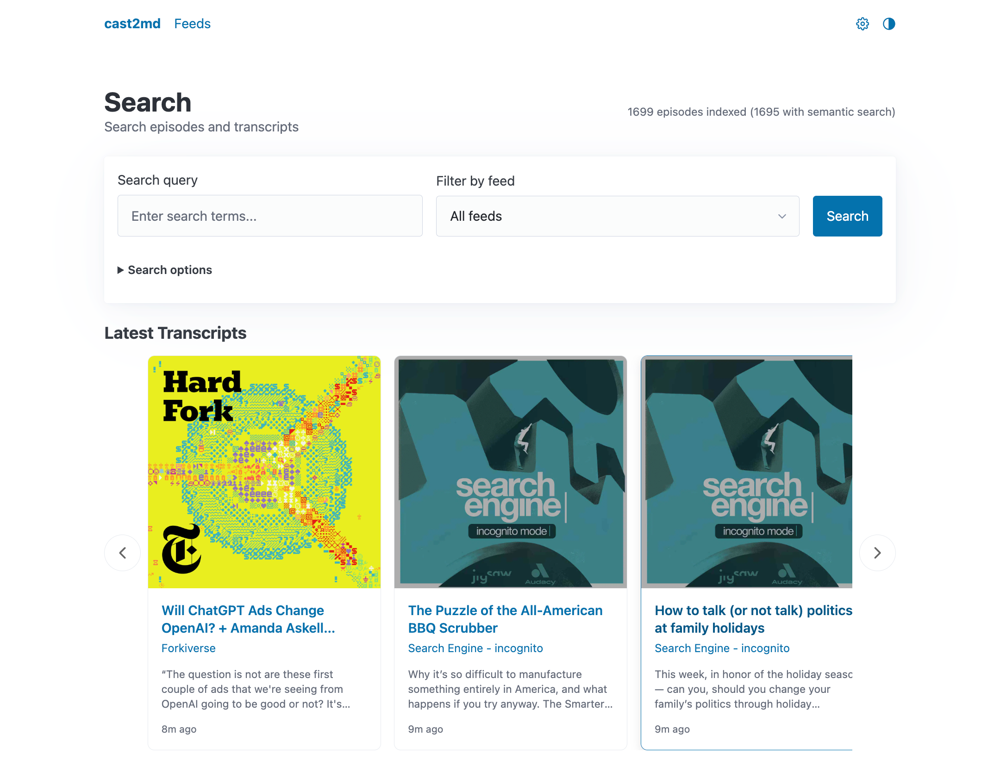

# cast2md

**Turn podcast RSS feeds into a searchable, LLM-ready transcript library.** Automatically fetches existing transcripts from publishers and Pocket Casts, or transcribes locally with Whisper. Search across everything, or chat with your podcasts via MCP.



---

## Features

<div class="grid cards" markdown>

-   :material-rss: **RSS Feed Management**

    Add podcast feeds via RSS or Apple Podcasts URLs. Automatic episode discovery and polling.

-   :material-robot: **Chat with Your Podcasts**

    Ask questions, summarize episodes, and explore topics across your library. Claude integration via Model Context Protocol.

-   :material-magnify: **Hybrid Search**

    Full-text and semantic search across episode metadata and transcript content with pgvector.

-   :material-text-search: **Transcript-First Workflow**

    Fetches transcripts from Podcasting 2.0 tags and Pocket Casts before downloading audio for Whisper.

-   :material-microphone: **Whisper Transcription**

    Local transcription with faster-whisper or mlx-whisper. Supports CPU, CUDA, and Apple Silicon.

-   :material-server-network: **Distributed Transcription**

    Use remote machines (M4 Macs, GPU PCs, RunPod) to transcribe in parallel.

-   :material-api: **REST API**

    Full API for automation and integration with other tools.

</div>

---

## Quick Start

=== "Docker (Recommended)"

    ```bash
    git clone https://github.com/meltforce/cast2md.git
    cd cast2md
    cp .env.example .env
    # Edit .env -- set POSTGRES_PASSWORD at minimum
    docker compose up -d
    ```

    Open `http://localhost:8000` to access the web UI.

=== "Manual Install"

    ```bash
    curl -LsSf https://astral.sh/uv/install.sh | sh
    git clone https://github.com/meltforce/cast2md.git
    cd cast2md
    uv sync --frozen
    cp .env.example .env
    # Edit .env with your settings
    uv run cast2md init-db
    uv run cast2md serve
    ```

See the [Installation Guide](installation/index.md) for full details.

!!! note "Personal Project"
    This is a personal project under active development. I'm sharing it in case others find it useful, but I'm not currently providing support or reviewing pull requests.

---

## Documentation

| Section | Description |
|---------|-------------|
| [Getting Started](getting-started/index.md) | What cast2md does and how it works |
| [Installation](installation/index.md) | Docker, manual install, and node setup |
| [Configuration](configuration/index.md) | Environment variables and settings |
| [Usage](usage/index.md) | Search and feed management |
| [Administration](administration/index.md) | Status monitoring, settings, queue, CLI, API, and MCP |
| [Features](features/index.md) | Architecture, transcript sources, search, episode states |
| [Distributed Transcription](distributed/index.md) | Multi-machine setup and RunPod GPU workers |
| [Deployment](deployment/index.md) | Production deployment and server sizing |
| [Development](development/index.md) | Dev setup, testing, and UI guidelines |
