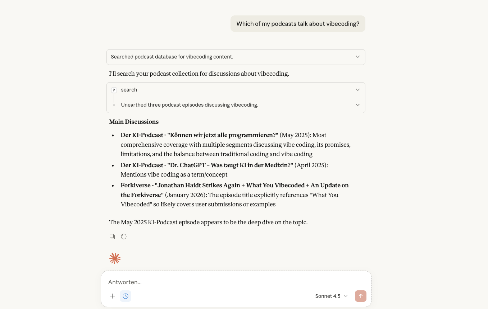

# Chat about your Podcasts

cast2md includes an MCP server that lets you chat about your podcasts with Claude or other LLMs. Ask questions in natural language -- search across all your transcripts, get summaries of episodes, find where a topic was discussed, or explore what your favorite podcasts have said about a subject. The LLM has full access to your podcast library and can pull up specific transcript passages with timestamps.

Some things you can ask:

- "What podcasts do I have?"
- "Search for episodes about protein and muscle building"
- "What was discussed in the latest Huberman Lab episode?"
- "Find where cold exposure is mentioned in my podcasts"

See [MCP Server](../usage/mcp.md) for setup instructions.
